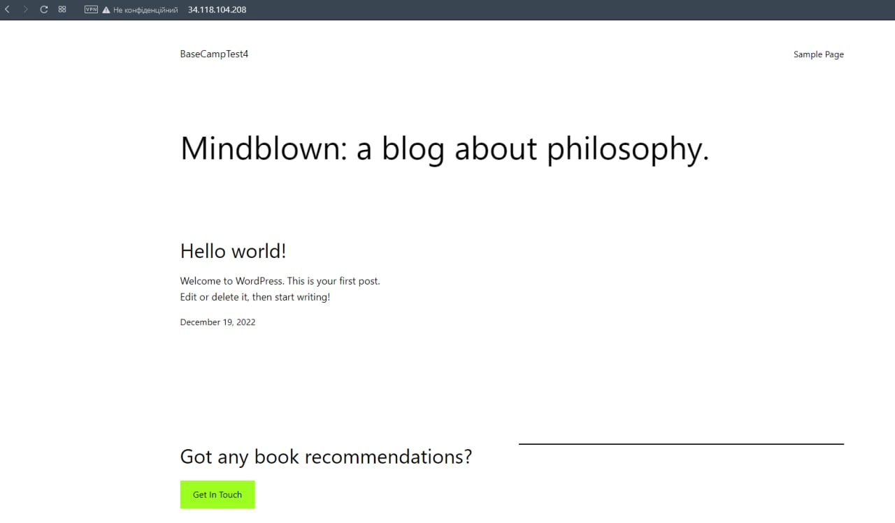
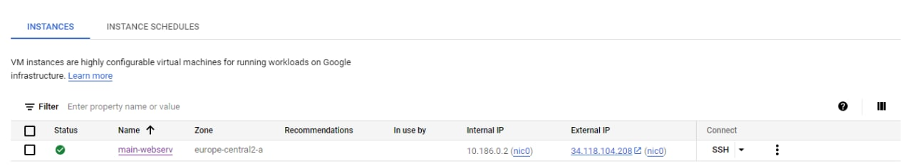
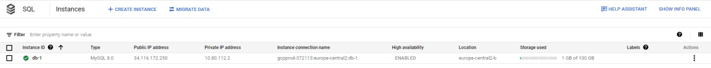
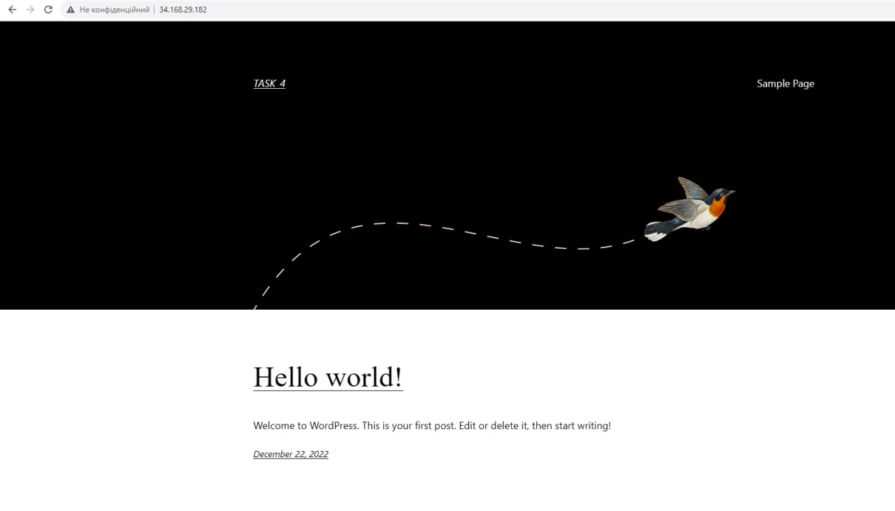
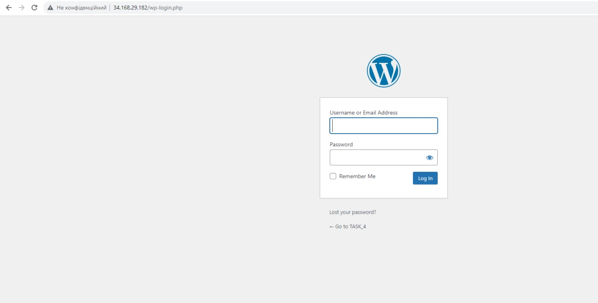

# LAMP Wordpress Deployment via UI
## http://34.118.104.208

## http://34.118.104.208/wp-login.php

# LAMP Wordpress Deployment via Terraform
To run this project, you need to create folder on your disk and copy [THIS FILE](main.tf) to this folder;  
To run script need add .json file with Service Accounts credentials;  
Then enter the following commands in Terminal:

* terraform init
* terraform plan
* terraform apply  

## Thank you for your attention!
